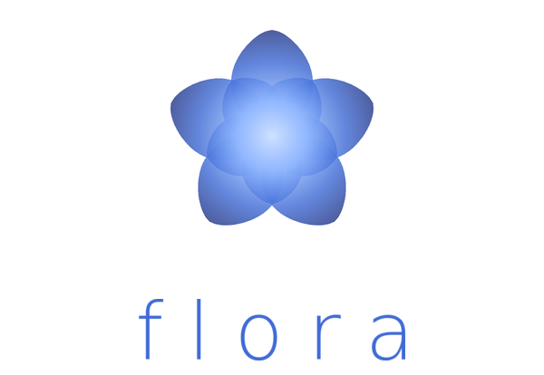

### A coding harness for large-scale long-term engineering

<h5 style="color: #5F7396; font-size: 18px;">MEMORY IN FRAGMENTS. UNDERSTANDING TAKES SHAPE.</h5>

<em>Dedicated to Sophia.</em>

---

## What is flora

**flora** is a coding harness built around an evolving graph of memory fragments, joined by strong and weak relationships. Its premise is that **understanding is a form that memory takes.** A fragment can participate in many overlapping contexts; its significance changes with the question being asked. In this design, each task brings a temporary arrangement into focus, and each result becomes material for what can be understood next. Context takes shape through the relationships between fragments. The ambition is to sustain engineering across vast codebases and long stretches of time through partial understandings that connect, overlap, and reshape one another.

> The name is the idea. flora draws on the image of a bloom. A *floret* is one of the many tiny flowers that together make up a larger bloom. The bloom takes its form from their arrangement. flora carries this intuition into engineering: fragments of memory, patterns of relation, a whole taking shape.

---

## License

Distributed under the terms of the [MIT License](LICENSE).
© 2026 urays.cc@gmail.com.
