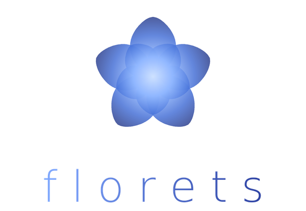

### An agentic coding harness for large-scale systems engineering

<em>Dedicated to Sophia.</em>

---

## What is florets

**florets** is an agentic coding harness built for codebases that are too large to fit in any one context window. Instead of asking an agent to reason about a million-line repository all at once, florets breaks the work into *florets* — small, self-contained units of change that can be planned, executed, and verified independently, then composed back into a single coherent result.

> The name is the idea. A *floret* is one of the many tiny flowers that together make up a larger bloom. A monorepo is the bloom; florets is what lets an agent tend it one floret at a time.

---

## License

Distributed under the terms of the [MIT License](LICENSE).
© 2026 urays.cc@gmail.com.
